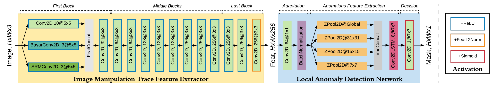
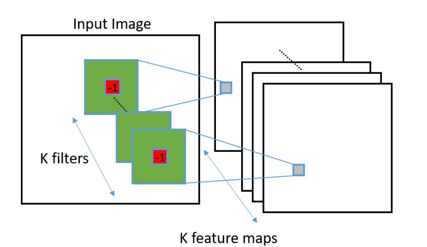
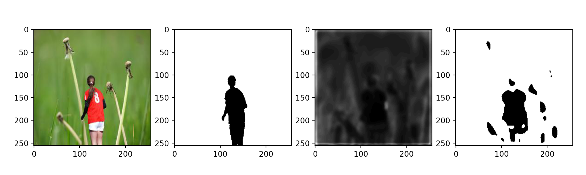
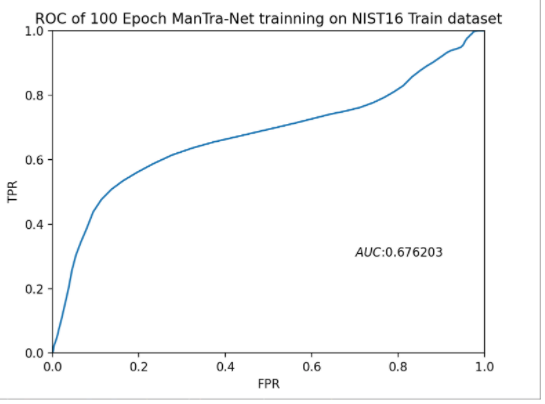

# ManTra-Net reproducing with pytorch
    [](https://GitHub.com/Sunnyhaze) 


This repository provides a reproduction of ManTra-Net which was proposed in CVPR 2019 by Yue Wu et al. 

What need to point out is that, the model in this Repo is mainly written by **Pytorch**, while the original paper provide a [Keras-Tensorflow sample on Github](https://github.com/ISICV/ManTraNet).

## Introduction
- Paper Titile : [ManTra-Net : Manipulation Tracing Network for Detection and Localization of Image Forgeries with Anomalous Features.](https://openaccess.thecvf.com/content_CVPR_2019/html/Wu_ManTra-Net_Manipulation_Tracing_Network_for_Detection_and_Localization_of_Image_CVPR_2019_paper.html)

- Part of Abstract: The ManTra-Net is an end-to-end network that performs both detection and localization without extra preprocessing and postprocessing. This model has the ability to fight against real-life image forgery, which commonly involves different types and combined manipulations.

- Overview of the architectue:
  
  

## Files in the repo
- [Mantra_Net.py](Mantra_Net.py) is the class of ManTra-Net which inherit from torch.nn.Module. This script imports several layers from directory `./imports`, including:
  - [CombindConv2D.py](imports/CombindConv2D.py): The combination of 3 kinds of different layers:
    - BayarConv2D, first proposed by [Bayar in 2018](https://ieeexplore.ieee.org/ielaam/10206/8361165/8335799-aam.pdf). Its filters can be illustrate as the figure below. Has a stronger ability to detecte manipulations.

      

    - SRMConv2D, first proposed in [this paper](http://www.isihome.ir/freearticle/ISIHome.ir-26078.pdf) and implemented in [this paper.](https://openaccess.thecvf.com/content_cvpr_2018/papers/Zhou_Learning_Rich_Features_CVPR_2018_paper.pdf) Three fixed filters are used to extract **noise features**. And when doing the process on RGB pictures, there will be 9 output channel for a 3 channel inputs.
     
      

    - Other filters are the normal Conv2D filters. In this reproduction, I choose (32 - 3 - 9) of this kind of filters, which is more than the number shows in the paper, but same as the orignal code on Github. (Really puzzling.) 
  - [ZPool2D.py](imports/ZPool2D.py) An algorithm proposed in this ManTra-Net article. Aiming to quantify the difference between a local feature and a reference dominant feature.
  - [convlstm.py](imports/convlstm.py) An implementation of ConvLSTM layer, which was cited from [ndrplz's Github repo](https://github.com/ndrplz/ConvLSTM_pytorch).
- What's more there is a [ParametersManager.py](imports/ParametersManager.py) file in `./imports` dir. This is a part of code helps me to save parameters after tarinning for several batches, and load parameters then.
- [Train.py](Train.py) is the main script for model trainning on **NIST16 dataset**. If you want to run this file, you need to load NIST16 data in advance. Please read this [NIST16 Dataset README](NC2016_Test0613/README.md) for tutorials.
- [TestModel.py](TestModel.py) can illustrate the performance of the model (`*.pt`) you trained. It shows 4 sub-figures in a plt, including(From left to right): Raw picture, label mask, predict feature, predict mask.
 
  
- [TestModelAUC.py](TestModelAUC.py) can calculate the AUC and ROC for you on trained models.

## Some Comments
It should be noted that this model gives poor results if predicted without using the official pre-training parameters. The ROC curve below demonstrated that **simply training and validating from the NIST16 dataset does not give good results**. 



However, we need to point out that in order to accelerate the trainning process, we resized images to (256x256), which reduced a lot of features, especially noise features. This problem has been discussed in the ManTra-Net paper as well. (Resize and JPEG compress will vitally do harm to the performance of the model) 

>We speculate that it is the strong dataset with 385 types of fine-grained manipulation images that made the model performs well. Sadly this dataset is not open to public :(


## Cite
[1] Wu, Y., AbdAlmageed, W., & Natarajan, P. (2019). Mantra-net: Manipulation tracing network for detection and localization of image forgeries with anomalous features. In Proceedings of the IEEE/CVF Conference on Computer Vision and Pattern Recognition (pp. 9543-9552).
  ```
  @InProceedings{Wu_2019_CVPR,
    author = {Wu, Yue and AbdAlmageed, Wael and Natarajan, Premkumar},
    title = {ManTra-Net: Manipulation Tracing Network for Detection and Localization of Image Forgeries With Anomalous Features},
    booktitle = {Proceedings of the IEEE/CVF Conference on Computer Vision and Pattern Recognition (CVPR)},
    month = {June},
    year = {2019}
  }
  ```

[2] Bayar, B., & Stamm, M. C. (2018). Constrained convolutional neural networks: A new approach towards general purpose image manipulation detection. IEEE Transactions on Information Forensics and Security, 13(11), 2691-2706.

[3] Fridrich, J., & Kodovsky, J. (2012). Rich models for steganalysis of digital images. IEEE Transactions on information Forensics and Security, 7(3), 868-882.